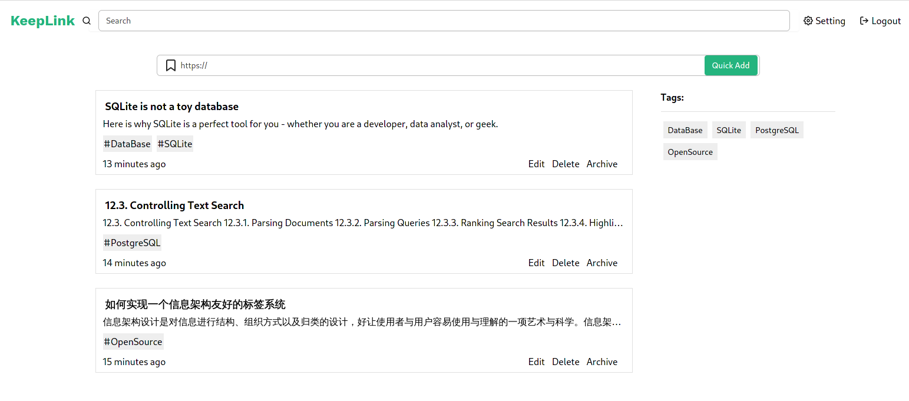

# KeepLink

KeepLink is a simple bookmark service with tags and archive build with Supabase and Next.js.
It doesn't have any social sharing featrue and You can [host your own instance](#self-hosting)

## Features Hightlight

1. Automatically tag new bookmark based on existed tags
2. Automatically fetch titles and descriptions with metascraper
3. Page archive with SinglePage and headless chrome
4. Fulltext search for url, title, description,tag and archived content
5. Tagging alias for admin
6. Database and restful API access thanks to Supabase stack

## ScreenShot

## Demo Site

Site: https://app.keelink.cc  
Account email and password is `demo@keelink.cc`

It is not a admin account, some admin feature like tag alias management are missing.

## Self hosting

KeepLink is build with Supabase stack and Next.js, But It cannot depoly directly on vercel.com and supabase.io (at least for now) for two reason.

1. KeepLink use rum index and zhparser for better serach support which is not currently exist in supabase's extensions list.
2. Next.js's API route has 10 seconds runtime limit for its hobby plain. Archving page with headless chrome might reach this limit. Maybe it can be solved by Supabase Workflows.

[Detail Self Hosting Guide](https://github.com/fengkx/keeplink/wiki/Self-Hosting)
